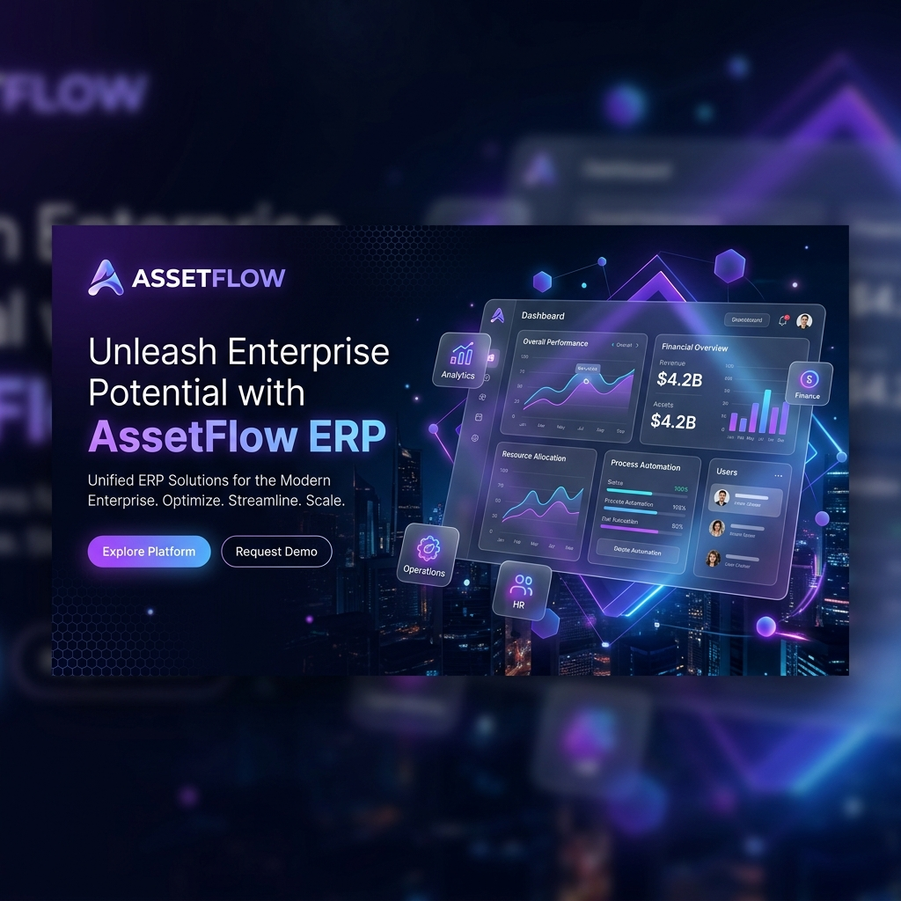
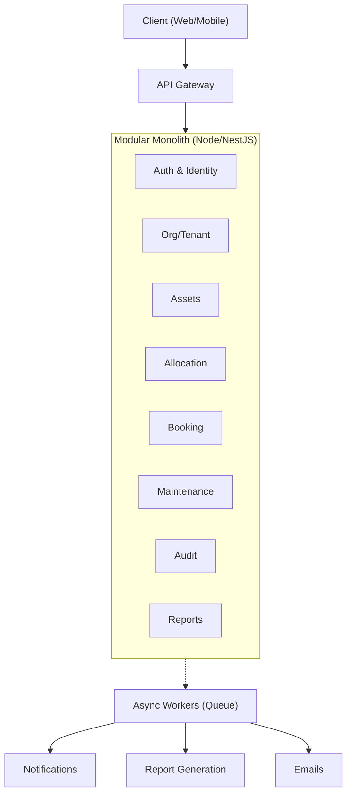

<div align="center">
  

  <h1>AssetFlow ERP</h1>
  <p><b>Production Architecture & Tech Stack</b></p>

  <p>
    <a href="#1-architecture"></a>
    <a href="#2-multi-tenancy"></a>
    <a href="#3-tech-stack"></a>
    <a href="#3-tech-stack"></a>
  </p>

  <p><i>A blueprint for turning a prototype into a multi-tenant, industry-grade SaaS ERP that any organization (schools, hospitals, factories, agencies, offices) can sign up for and run at scale.</i></p>
</div>

---

## 🏗 1. Architecture Style: Modular Monolith → Microservices-Ready

For an ERP at this stage, we avoid premature distributed-systems complexity by starting with a **Modular Monolith** (one deployable backend, strict internal module boundaries). We will only split modules into standalone microservices when specific independent scaling is required (e.g., Notifications, Reports/Analytics, File storage).



> [!TIP]
> **Split Candidates as you scale:** Notifications Service, Reporting/Analytics Service (heavy read + OLAP), File/Document Service (photos, PDFs), Search Service.

---

## 🏢 2. Multi-Tenancy (The Core Production Decision)

Since "every company" will use this, the tenancy strategy drives almost everything else. 

| Approach | Description | When to use |
|---|---|---|
| **Shared DB + RLS** | One Postgres cluster, every query scoped by `tenant_id`, enforced via Postgres Row-Level Security (RLS) policies. | **Recommended default** — cheapest to operate, easiest to patch/migrate for all tenants at once. |
| **Schema-per-tenant** | One Postgres schema per company inside a shared cluster. | Mid-size customers wanting stronger isolation without full infra cost. |
| **Database-per-tenant** | Dedicated DB (or cluster) per large customer. | Enterprise/regulated customers (hospitals, banks) who require data isolation & custom SLAs. |

> [!IMPORTANT]
> **Implementation:** Start with shared-DB + `tenant_id` + Postgres Row-Level Security as the default tier, and offer schema/DB isolation as an "Enterprise" plan. Every table gets `tenant_id UUID NOT NULL`, every index is composite `(tenant_id, ...)`, and RLS policies make cross-tenant leaks a database-level impossibility, not just an app-level discipline.

---

## 🛠 3. Tech Stack

### 🎨 Frontend
- **Framework:** React + TypeScript (Next.js for SSR/SEO on marketing/login pages, CSR for the app shell).
- **State/Data:** TanStack Query (server cache) + Zustand (client/UI state).
- **UI Kit:** Tailwind CSS + Radix Primitives — matches our ultra-modern Odoo-style design tokens.
- **Forms:** React Hook Form + Zod schema validation.
- **Complex UI:** TanStack Table (datagrids), dnd-kit (kanban drag), FullCalendar (booking overlap UI).
- **Charts:** Recharts or ECharts for reports/heatmaps.
- **Mobile:** React Native (Expo) reusing the same design tokens and API client.

### ⚙️ Backend
- **Framework:** Node.js + **NestJS** (TypeScript, modular by design, built-in DI, guards for RBAC, first-class OpenAPI).
- **API Style:** REST (OpenAPI/Swagger-documented) for CRUD-heavy modules.
- **Auth:** OAuth2/OIDC via a dedicated identity provider (Auth0 / Clerk / Keycloak) to support SSO (SAML/OIDC), MFA, and GitHub/Google social login.
- **Authorization:** RBAC + attribute-based scoping (tenant-scoped). Implemented with NestJS Guards — never scatter `if (role === 'admin')` checks through business logic.
- **Background Jobs:** BullMQ (Redis-backed) or Temporal.
- **Realtime:** WebSockets (Socket.IO) for live dashboard KPIs, notification pushes, kanban updates.

### 🗄 Data Layer
- **Primary DB:** PostgreSQL (Relational integrity fits ERP relationships perfectly; supports RLS and JSONB).
- **ORM:** Prisma (Absolute type-safety from DB to client).
- **Cache:** Redis (Session cache, rate limiting, booking-slot locking).
- **Search:** Postgres full-text search initially; move to Elasticsearch later.
- **Storage:** AWS S3, Cloudflare R2, or MinIO for asset photos, warranty PDFs, maintenance images.

### 🚀 Infrastructure & DevOps
- **Containerization:** Docker & Kubernetes (EKS/GKE/AKS).
- **IaC:** Terraform for all cloud resources.
- **CI/CD:** GitHub Actions (lint → test → build → containerize → deploy).
- **API Gateway:** Kong or NGINX.
- **CDN:** Cloudflare.

### 🛡 Security & Compliance
- **Encryption:** At rest (DB, S3) and in transit (TLS everywhere).
- **Secrets Management:** AWS Secrets Manager / HashiCorp Vault.
- **Audit Logging:** Immutable append-only table (write-once, queryable, exportable).
- **Compliance:** SOC 2 Type II (baseline), GDPR, HIPAA (if hospitals), ISO 27001.

---

## 📂 4. Monorepo Folder Structure

A **Turborepo** monorepo keeps shared types, UI components, and API contracts in sync across web, mobile, and backend.

```text
assetflow/
├── apps/
│   ├── web/                        # Next.js frontend
│   │   ├── src/app/                # route-based pages
│   │   │   ├── (auth)/login/
│   │   │   ├── (dashboard)/dashboard/
│   │   │   ├── (dashboard)/organization/
│   │   │   ├── (dashboard)/assets/
│   │   │   ├── (dashboard)/allocation/
│   │   │   ├── (dashboard)/booking/
│   │   │   └── ...
│   │   └── components/             # feature components
│   │
│   ├── web-prototype/              # Original Vanilla JS High-Fidelity UI
│   │
│   └── api/                        # NestJS backend (modular monolith)
│       ├── prisma/                 # PostgreSQL Schema
│       └── src/
│           ├── common/             # guards, interceptors, filters
│           └── modules/            # Strict Modular Monolith boundaries
│               ├── auth/           # login, signup, SSO
│               ├── tenants/        # org provisioning
│               ├── assets/         # registry, state machine
│               ├── allocation/     # allocate, transfer, return
│               ├── booking/        # reservations, overlap validation
│               ├── maintenance/    # kanban workflow
│               ├── audit/          # audit cycles
│               └── activity-log/   # immutable ledger
│
├── packages/
│   ├── shared-types/               # Zod schemas shared FE↔BE
│   ├── config/                     # eslint, tsconfig presets
│   └── ui/                         # shared design-system components
│
├── infra/                          # Terraform, K8s, Docker
├── .github/workflows/              # CI/CD pipelines
├── docs/                           # ADRs, API docs
├── turbo.json                      # Turborepo config
└── package.json
```

---

## ⚠️ 5. Strict Domain Logic Rules

These rules from the spec are easy to get subtly wrong at scale — they are explicitly enforced at the database layer:

> [!CAUTION]
> **Allocation conflict check:** Must be done inside a DB transaction with row locking (`SELECT ... FOR UPDATE`). An app-level check-then-write is unacceptable and will cause race conditions where two simultaneous allocation requests both "pass" and double-allocate the same asset.

> [!CAUTION]
> **Booking overlap validation:** Same race-condition risk. Use a Postgres **exclusion constraint** (`EXCLUDE USING gist`) so the database itself physically rejects overlapping bookings, instead of relying purely on application logic.

- **Asset Lifecycle Transitions:** Modeled as an explicit state machine. Invalid transitions (`Available → Under Maintenance` without approval) are hard-rejected.
- **Audit Cycle Closure:** Runs as a single atomic transaction with an idempotency key. A retried "Close cycle" click cannot double-apply.
- **Activity Log Immutability:** The activity log table is insert-only at the Postgres permission level. No UPDATE/DELETE grants exist for the app's DB role, guaranteeing a trustworthy audit trail.

---

## 📈 6. Phased Rollout

1. **MVP:** Modular monolith, shared-DB multi-tenancy, Auth, Org setup, Assets, Allocation, Booking, Maintenance.
2. **Hardening:** RLS everywhere, row-locking on conflict-prone writes, audit-log immutability, SSO for enterprise pilots.
3. **Scale-out:** Split Notifications and Reports into standalone services behind BullMQ; add read replicas; introduce OpenTelemetry.
4. **Enterprise Tier:** Schema/DB-per-tenant option, SOC 2 audit, custom SLAs, data residency options.

<div align="center">
  <sub><i>This is a reference architecture. The right amount of infrastructure scales with actual customer count and compliance requirements. Most ERP SaaS products stay comfortably on the modular monolith + shared Postgres model well past their first 10,000 paying customers.</i></sub>
</div>